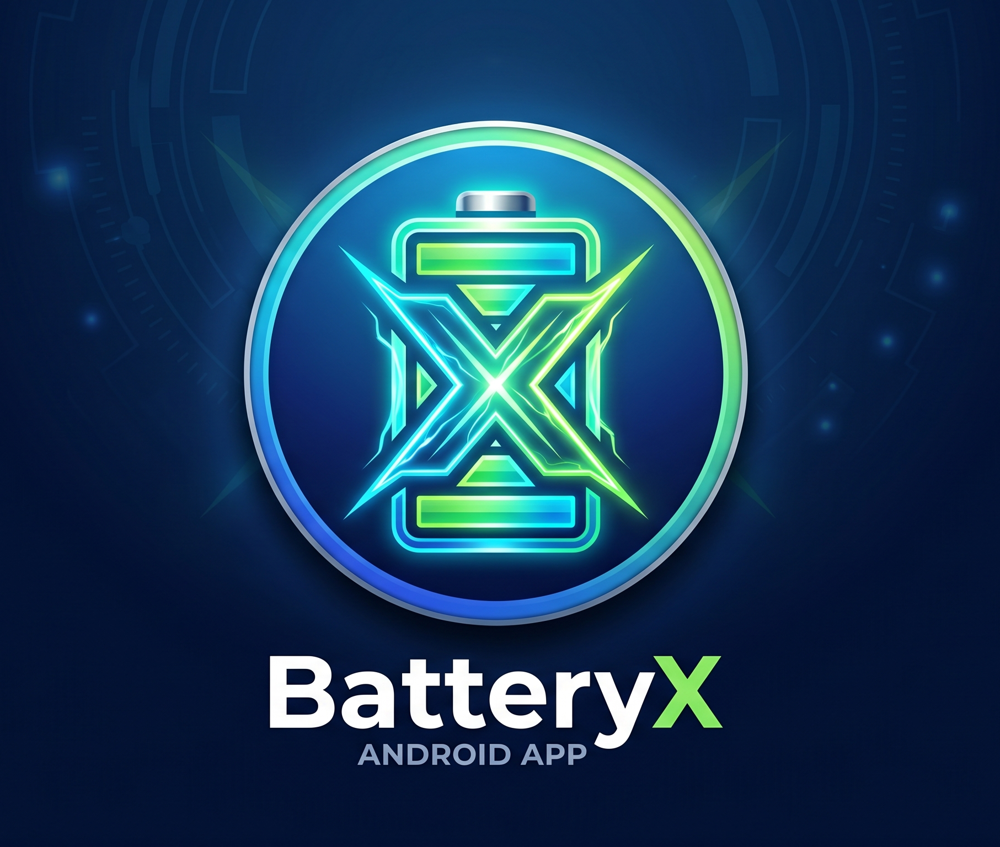

# 🔋 BatteryX

<p align="center">
  
</p>

<h1 align="center">
BatteryX
</h1>

<p align="center">
<b>
The Next Generation Battery Intelligence Application for Android
</b>
</p>

<p align="center">
Monitor battery health, analyze charging behavior, and understand your device battery with beautiful analytics and intelligent insights.
</p>


<p align="center">


</p>


---

# 📱 About BatteryX

BatteryX is a modern Android battery monitoring and analytics application built using **Kotlin and Jetpack Compose**.

The goal of BatteryX is to provide users with complete knowledge about their device battery:

- How healthy is the battery?
- How fast is it charging?
- How much capacity has been lost?
- What is causing battery drain?
- How can battery lifespan be improved?

BatteryX combines real-time monitoring, historical analysis, and intelligent insights into a beautiful premium Android experience.


---

# ✨ Features

## 🔋 Real-Time Battery Monitoring

BatteryX continuously monitors:

- Battery percentage
- Charging status
- Battery temperature
- Voltage
- Current flow
- Charging power
- Battery technology
- Remaining battery estimation


---

# ❤️ Battery Health Intelligence

BatteryX estimates battery health by analyzing charging behavior over time.

Features:

- Battery health percentage
- Estimated battery capacity
- Battery wear calculation
- Capacity degradation tracking
- Historical health reports


Example:

```
Battery Information

Design Capacity:
5000 mAh

Estimated Capacity:
4500 mAh

Battery Health:
90%
```

---

# ⚡ Smart Charging Monitor

Track every charging session in detail.

BatteryX records:

- Charging start time
- Charging end time
- Charging duration
- Current speed
- Voltage
- Energy added
- Charging efficiency


---

# 🔔 Smart Charge Alarm

Protect your battery lifespan by avoiding unnecessary overcharging.

Choose your charging limit:

```
70%
75%
80%
85%
90%
```

Features:

- Smart notifications
- Vibration alerts
- Custom charging limits


---

# 📊 Advanced Battery Analytics

BatteryX provides beautiful visual analytics:

- Battery level history
- Charging graphs
- Temperature graphs
- Usage trends
- Battery health timeline


Features:

- Interactive charts
- Smooth animations
- Real-time updates
- Dark mode support


---

# 🌡 Battery Temperature Monitor

Monitor thermal performance:

- Current temperature
- Average temperature
- Maximum temperature
- Temperature history


BatteryX can detect:

- High temperature charging
- Thermal stress
- Abnormal heating


---

# 🤖 Smart Battery Insights

BatteryX analyzes battery behavior and provides useful recommendations.

Examples:

```
Your battery temperature is higher than normal.
Avoid heavy usage while charging.
```

```
Charging speed is slower compared to previous sessions.
Check your charger or cable.
```

```
Battery health decreased by 2% this month.
```

---

# 🔮 Battery Lifetime Prediction

Future feature:

BatteryX will estimate:

- Remaining battery lifespan
- Battery degradation speed
- Expected replacement period
- Long-term health prediction


---

# 🎨 Premium User Interface

BatteryX focuses heavily on user experience.

Designed with:

- Jetpack Compose
- Material 3
- Smooth transitions
- Fluid animations
- Dynamic colors
- AMOLED dark theme
- Beautiful data visualization


The goal is to create one of the most visually advanced battery applications on Android.


---

# 🏗 Project Architecture

BatteryX follows Clean Architecture with MVVM design.


```
BatteryX
│
├── app
│
├── data
│   │
│   ├── database
│   ├── repository
│   └── datasource
│
├── domain
│   │
│   ├── models
│   ├── usecases
│   └── calculations
│
├── presentation
│   │
│   ├── screens
│   ├── components
│   └── navigation
│
└── services
    │
    └── Battery Monitoring Service

```


---

# 🛠 Technology Stack

## Programming Language

- Kotlin


## UI Framework

- Jetpack Compose
- Material 3


## Architecture

- MVVM
- Clean Architecture


## Dependency Injection

- Hilt


## Database

- Room Database


## Async Programming

- Kotlin Coroutines
- Flow


## Background Processing

- WorkManager
- Foreground Services


---

# 📡 Android Battery APIs

BatteryX uses official Android APIs.

## BatteryManager

Used for:

- Current measurement
- Charge counter
- Battery properties


## ACTION_BATTERY_CHANGED

Used for:

- Battery percentage
- Charging state
- Temperature
- Voltage


---

# 🧮 Battery Health Calculation

Android does not expose the exact battery health on every device.

BatteryX estimates health using charging data.

Formula:

```
Estimated Capacity =
Total Charge Added During Charging Sessions
```

Battery Health:

```
Health Percentage =
Estimated Capacity / Design Capacity × 100
```

The more charging sessions collected, the more accurate the estimation becomes.


---

# 🔐 Privacy First

BatteryX respects user privacy.

Features:

✅ No account required  
✅ No unnecessary permissions  
✅ No tracking  
✅ No advertisements  
✅ Offline-first design  
✅ Local database storage  


Your battery information stays on your device.


---

# 📂 Project Structure

```
BatteryX

├── logo.png

├── app/

├── README.md

├── build.gradle

└── settings.gradle

```


---

# 🚀 Installation


Clone the repository:

```bash
git clone https://github.com/YOUR_USERNAME/BatteryX.git
```


Open the project:

```
Android Studio
```

Build and run on your Android device.


---

# 📋 Requirements

```
Android 10+

Kotlin

Android Studio Latest Version
```


---

# 🗺 Roadmap


## Version 1.0

- [ ] Battery dashboard
- [ ] Real-time monitoring
- [ ] Charging tracker
- [ ] Battery history
- [ ] Health estimation


## Version 2.0

- [ ] AI battery assistant
- [ ] Battery prediction
- [ ] Advanced analytics
- [ ] Home screen widgets


## Version 3.0

- [ ] Wear OS support
- [ ] Cloud backup
- [ ] Smart automation
- [ ] More device integrations


---

# 🤝 Contributing

Contributions are welcome.

Steps:

1. Fork this repository

2. Create a new branch:

```bash
git checkout -b feature/new-feature
```

3. Commit changes:

```bash
git commit -m "Add new feature"
```

4. Push:

```bash
git push origin feature/new-feature
```

5. Create a Pull Request


---

# ⭐ Support

If you like BatteryX:

⭐ Star this repository  
🐛 Report issues  
💡 Suggest improvements  
🤝 Contribute code  


---

# 📄 License

BatteryX is licensed under the MIT License.


---

# 👨‍💻 Author

Created with ❤️ using Kotlin and Jetpack Compose.

